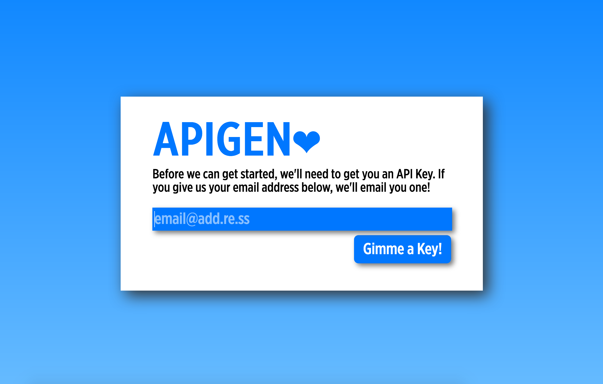
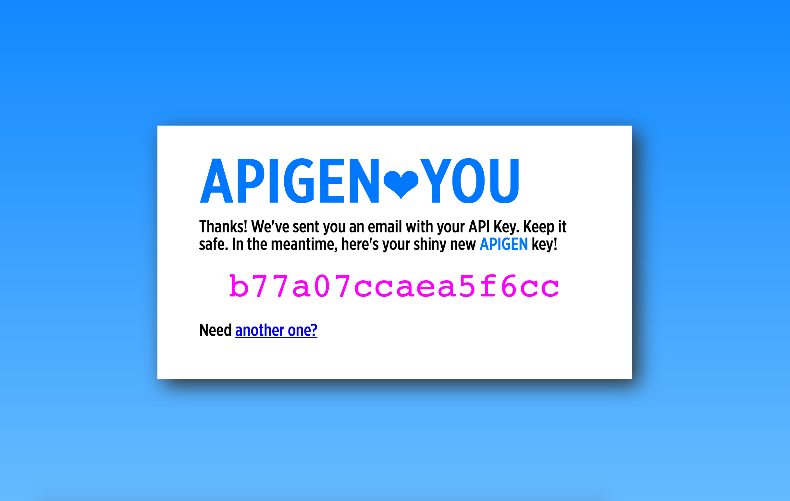

APIGEN
======

APIGEN is a simple test app, deployable to a Cloud Floundry near
you, that uses the [Vault-Broker][1].  It was part of my talk,
_The Vault Of Secrets_, presented at Cloud Foundry North America
Summit, 2018, in Boston, MA.  Slides are available [online][2].

[1]: https://github.com/cloudfoundry-community/vault-broker
[2]: https://github.com/jhunt/slides/tree/master/vault
